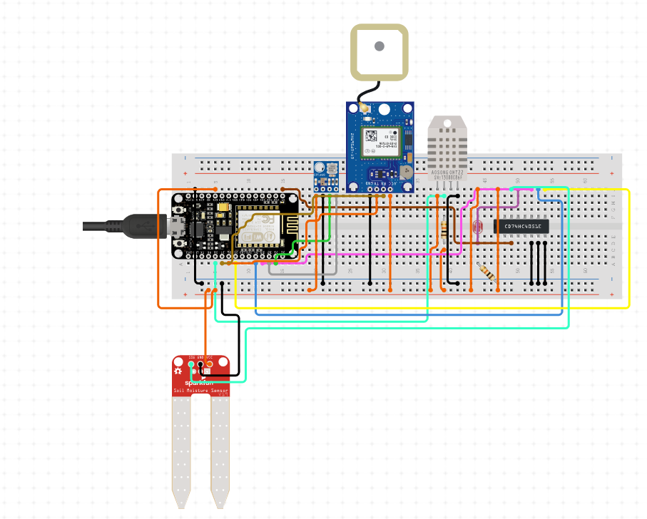
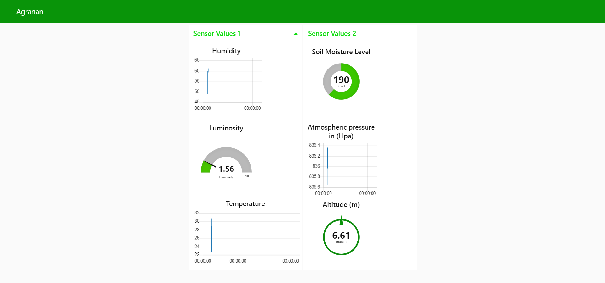

## Agrarian Smart Farm Solution

### Installing

To Contribute Clone the project and ensure that the firmware file is put inside a folder named as the firmware file before openening it on arduino ide.

To have the dashboard nodes on Node-red import the json from flows.json

### Parts

 * ESP8266 NodeMCU 12-E
 * BMP180
 * LDR
 * DHT22
 * Capacitive Soil Moisture
 * 3.7 v Lithium rechargable battery
 * 2 x 10K Ohm resistors

### Circuit
 

### Dependecies

Node-red, Mqttbroker e.g Mosquitto

### App dashboard

  
